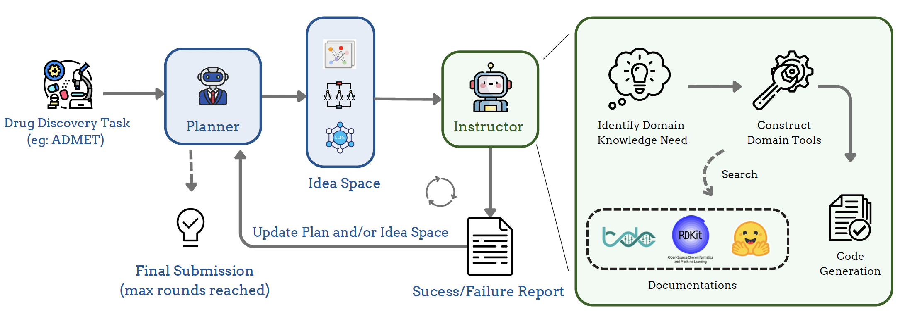

# DrugAgent: Automating AI-aided Drug Discovery Programming through LLM Multi-Agent Collaboration

## Overview

<p align="center">
  
</p>

DrugAgent is a multi-agent LLM framework that unifies ML programming with biomedical expertise to address the demands of modern drug discovery. It integrates two primary agents: (1) an LLM Planner, which manages the high-level generation and refinement of solution ideas, and (2) an LLM Instructor, which translates these ideas into concrete code, drawing on domain-specific knowledge to address the complex needs of drug discovery tasks.

## Installation

DrugAgent is built upon the MLAgentBench project. We thank the original authors for their valuable work. To install DrugAgent, follow the steps below:

1. **Clone the Repository**

   ```bash
   git clone https://anonymous.4open.science/r/drugagent-5C42.git
   cd drugagent
   ```

2. **Create a New Conda Environment**

   ```bash
    conda create --name drugagent python=3.10
    conda activate drugagent
   ```
2. **Install Dependencies**
   ```bash
   pip install -r requirements.txt
   ```


# Quick Start

To run our drugagent on admet task with openai API using gpt-4o-mini:

```
python -u -m drugagent.runner --task admet --device 0 --log-dir first_test  --work-dir workspace  >  log 2>&1 --llm-name openai/gpt-4o-mini --edit-script-llm-name openai/gpt-4o-mini --fast-llm-name openai/gpt-4o-mini
```


This will produce logs in `first_test` directory with the following structure
```
first_test/
    agent_log/
        Planner_log # log showing Planner agent's research process
        Insturctor_log # log showing Instructor agent's research process
        agent_*.json # saved agent states
        ...
    env_log/
        tool_logs/ 
        traces/ # snap shots of the agent workspace
        trace.json # interaction trace of the agent
        ...
```

# Evaluation

To run evaluation:
```
python -m MLAgentBench.eval --log-folder <log_folder>  --task <task_name> --output-file <output_name>
```

This will evaluate all runs under <log_folder> as a json.

Note: As this is an early version intended for research use, some code styles may not be fully polished. We will continue to refine and update the project in future releases.